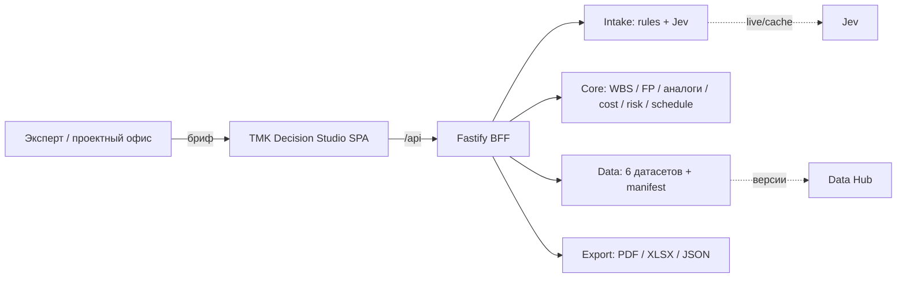
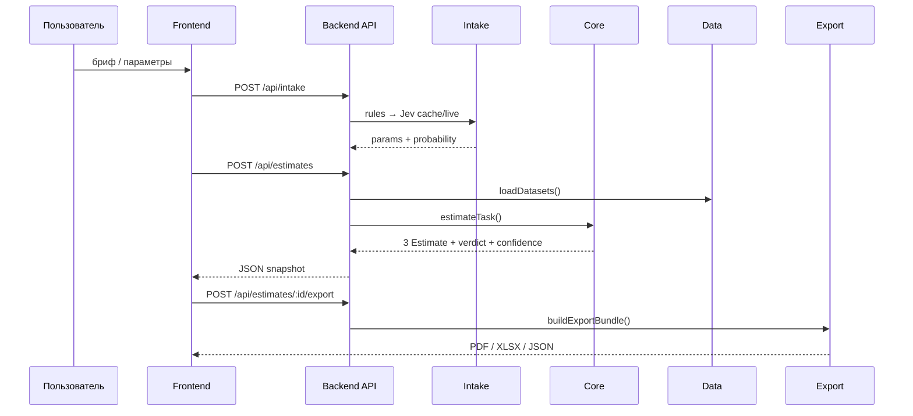
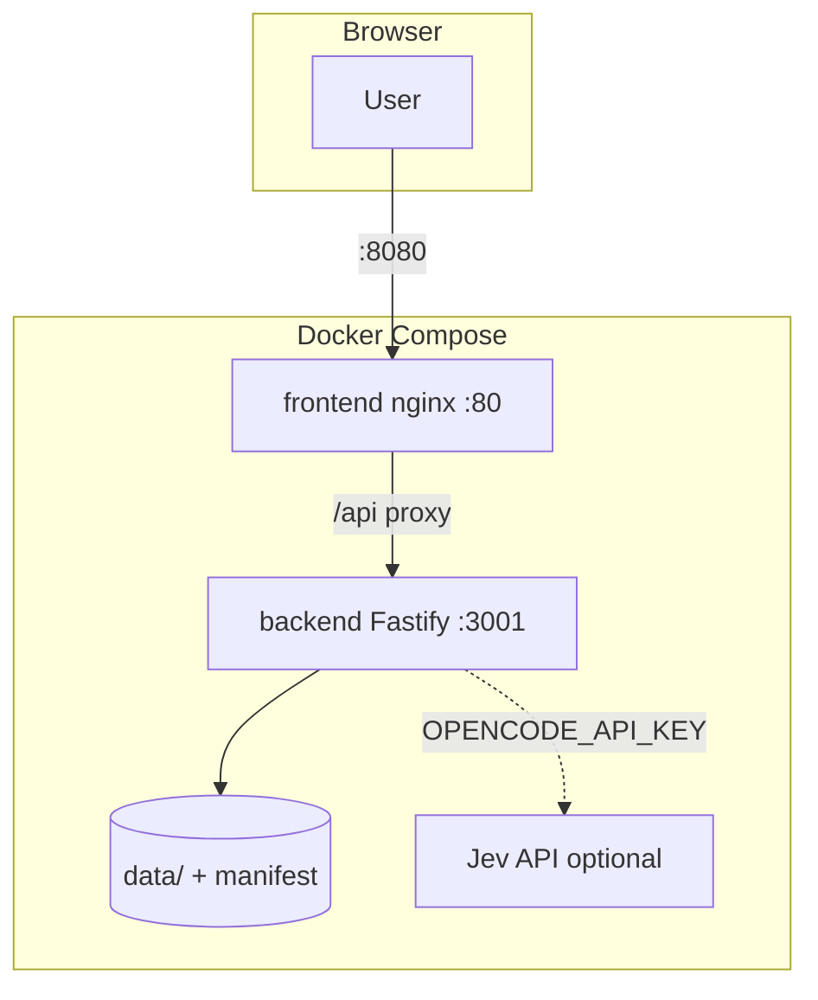
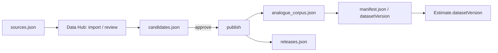

# Схемы системы

## 1. Контекст

```mermaid
flowchart LR
  U[Эксперт / проектный офис] -->|бриф| W[TMK Decision Studio SPA]
  W -->|/api| B[Fastify BFF]
  B --> I[Intake: rules + Jev]
  B --> C[Core: WBS / FP / аналоги / cost / risk / schedule]
  B --> D[Data: 6 датасетов + manifest]
  B --> E[Export: PDF / XLSX / JSON]
  I -. live/cache .-> J[Jev]
  D -. версии .-> H[Data Hub]
```

## 2. Расчётный поток

```mermaid
sequenceDiagram
  participant U as Пользователь
  participant F as Frontend
  participant A as Backend API
  participant I as Intake
  participant C as Core
  participant D as Data
  participant E as Export

  U->>F: бриф / параметры
  F->>A: POST /api/intake
  A->>I: rules → Jev cache/live
  I-->>A: params + probability
  F->>A: POST /api/estimates
  A->>D: loadDatasets()
  A->>C: estimateTask()
  C-->>A: 3 Estimate + verdict + confidence
  A-->>F: JSON snapshot
  F->>A: POST /api/estimates/:id/export
  A->>E: buildExportBundle()
  E-->>F: PDF / XLSX / JSON
```

## 3. Docker deployment

```mermaid
flowchart TB
  subgraph Browser
    U[User]
  end
  subgraph Compose[Docker Compose]
    F[frontend nginx :80]
    B[backend Fastify :3001]
    D[(data/ + manifest)]
    J[Jev API optional]
  end
  U -->|:8080| F
  F -->|/api proxy| B
  B --> D
  B -. OPENCODE_API_KEY .-> J
```

## 4. Данные и версии

```mermaid
flowchart LR
  S[sources.json] --> H[Data Hub: import / review]
  H --> C[candidates.json]
  C -->|approve| P[publish]
  P --> A[analogue_corpus.json]
  A --> M[manifest.json / datasetVersion]
  M --> E[Estimate.datasetVersion]
  P --> R[releases.json]
```

Полная архитектура — `ARCHITECTURE.md`, модель — `DATA_MODEL.md`.
